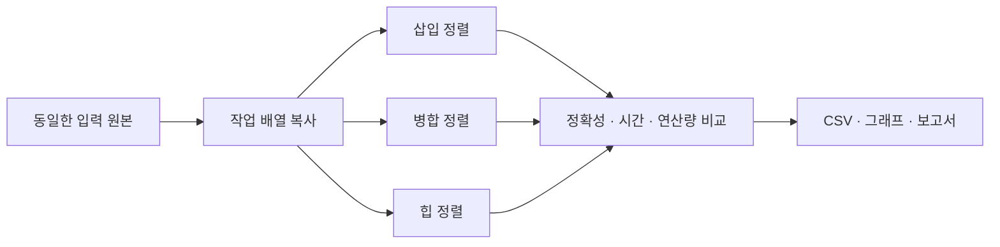
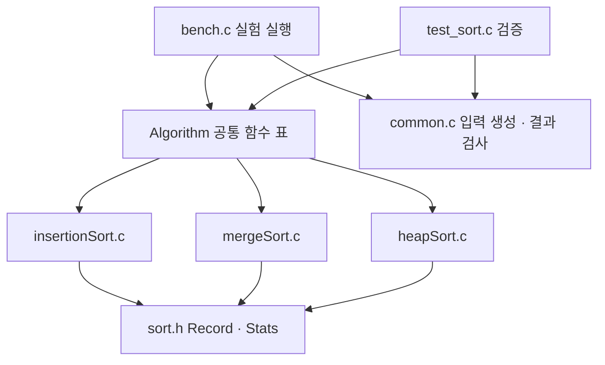
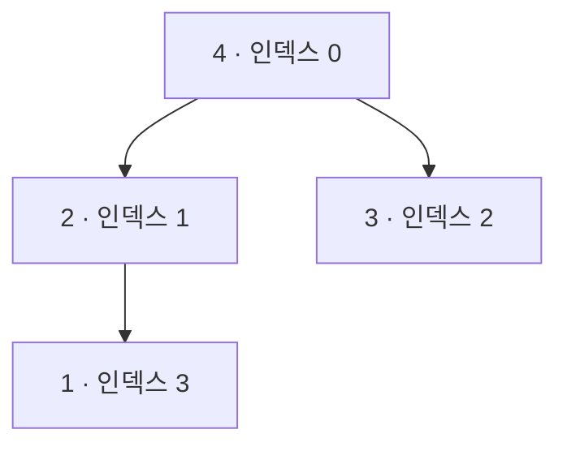
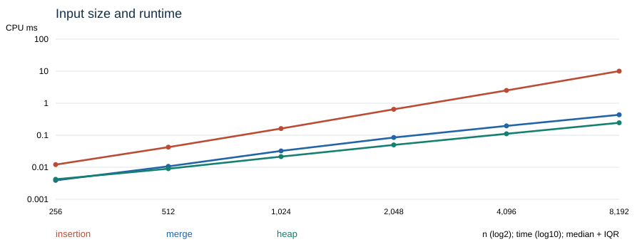
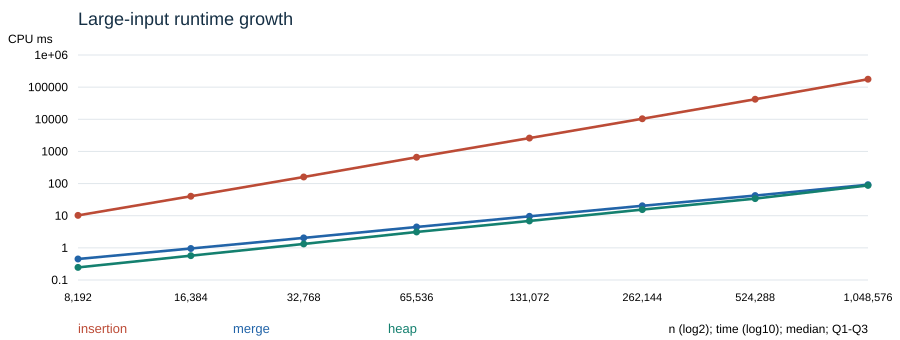

# 과제 1. Compare sorting

**삽입 · 병합 · 힙 정렬의 입력 조건별 성능 비교**


2022193003 김형균

## 1. 목적과 설계

배운 정렬 중 삽입 정렬과 병합 정렬을, 배우지 않은 정렬로는 Wikipedia 링크 내에서 힙 정렬을 선택하였다.
세 알고리즘을 같은 입력으로 실행하여 속도뿐 아니라 비교·이동 횟수, 보조 공간, 안정성을 비교한다.

| 선택 | 비교하려는 특징 | 평균 / 최악 시간 | 전체 보조 공간 | 안정성 |
| --- | --- | --- | --- | --- |
| 삽입 | 입력이 이미 정렬되었을 때의 이점 | O(n²) / O(n²) | O(1) | 안정 |
| 병합 | 안정성과 효율을 위해 사용하는 버퍼 | O(n log n) / O(n log n) | O(n) | 안정 |
| 힙 | 버퍼 없이 얻는 최악 시간 보장 | O(n log n) / O(n log n) | O(1) | 불안정 |

표는 이 보고서의 구현을 기준으로 한다. 삽입 정렬의 최선은 O(n)이다.
병합과 힙은 반복형으로 구현하여 재귀 스택을 사용하지 않는다. [2-4]



### 실험 전 예상

무작위 입력에서는 삽입 정렬의 증가율이 클 것으로 예상했다. 정렬됨·거의 정렬됨에서는
삽입 정렬이 유리할 것으로 예상했다. 병합과 힙은 같은 시간 차수이므로 절대적인 우열을
가정하지 않고 실측한다. 메모리와 안정성은 속도와 함께 선택 기준으로 삼는다.

교수님의 예시 [1]에서 알고리즘·측정·테스트 분리와 key/tag 안정성 검사를 참고하였다.
코드는 새로 작성했으며 예시의 측정값을 재사용하지 않았다.

<!-- PAGE -->

## 2. 구현 구조와 배운 정렬



모든 정렬은 Record 배열과 길이, 선택적 Stats를 받는다. Record는 key와 원래 위치 tag를
갖지만 비교에는 key만 사용한다. 실패할 수 있는 병합 버퍼 할당은 반환값으로 알리고,
실험 프로그램은 오류를 만나면 중단한다. key 비교는 뺄셈 대신 대소관계로 수행해 정수 넘침을 피한다.

### 2.1 삽입 정렬

앞부분을 정렬된 상태로 유지하며 다음 원소를 알맞은 위치에 삽입한다. 바로 앞 원소가
현재 원소 이하이면 이동 없이 건너뛴다. 이동할 때에는 더 큰 원소만 오른쪽으로 밀어,
같은 key의 입력 순서를 보존한다. 이미 정렬된 n개에서는 비교 n−1회, 이동 0회다.

### 2.2 병합 정렬

폭 1인 정렬 구간에서 시작해 이웃 구간을 병합하며 폭을 2배씩 늘리는 bottom-up 방식이다.
하나의 n개짜리 버퍼를 재사용하고, 각 병합 결과를 원본 배열로 되쓴다. 동률이면 왼쪽
원소를 먼저 선택하므로 안정적이다. 이 구현에는 이미 정렬된 경계를 건너뛰는 최적화를 넣지 않았다.
따라서 정렬된 입력에서도 모든 병합 단계를 수행한다.


### 구현 선택이 측정에 미치는 영향

이동 횟수는 Record 한 개를 저장할 때 1회로 센다. 교환은 임시 저장을 포함해 3회다.
병합은 버퍼에 쓰기와 원본으로 되쓰기를 모두 센다. 이는 소스 수준의 논리적 연산량이며,
컴파일러가 생성한 기계 명령 수와 같지 않다. 선택한 구현의 성능을 비교하는 실험이다.

<!-- PAGE -->

## 3. 힙 정렬

### 3.1 핵심 개념

최대 힙은 정렬된 배열이 아니라, 부모의 key가 자식 이상이라는 조건을
만족하는 완전 이진 트리임을 이해하였다. 배열 인덱스 i의 자식은 2i+1, 2i+2이고
최대값은 루트 0번에 있다. 다음은 [4,2,3,1]의 최대 힙이다.



siftDown은 두 자식 중 큰 쪽을 선택하고 부모가 더 작으면 교환한다. 자식 서브트리가
이미 힙이라는 전제에서 현재 루트의 힙 조건을 복구한다. 마지막 내부 노드에서 루트로
거슬러 올라가면 전체 힙을 만들 수 있다. [2]

### 3.2 작은 입력으로 이해한 과정

| 단계 | 배열 | 의미 |
| --- | --- | --- |
| 입력 | [4, 1, 3, 2] | 아직 힙이 아님 |
| 힙 구성 | [4, 2, 3, 1] | 루트가 최대값 |
| 4 추출 후 복구 | [3, 2, 1 ∣ 4] | 오른쪽 4 확정 |
| 3 추출 후 복구 | [2, 1 ∣ 3, 4] | 오른쪽 두 원소 확정 |
| 완료 | [1 ∣ 2, 3, 4] | 오름차순 완성 |

### 3.3 복잡도와 안정성
대부분의 노드는 아래쪽에 있어, 높이 h의 노드 수가 대략 n/2^(h+1)이므로 비용을
높이별로 합하면 O(n)이다. 이후 최대값 추출을 반복하는 단계가 O(n log n)을 차지한다.

힙 정렬은 불안정하다. 두 원소 [(1,A),(1,B)]만 있어도 루트와 끝을 교환하면 [(1,B),(1,A)]가 된다.
이 반례를 테스트에 넣어 확인하였다. 자세한 AI 학습 정리는 [AI_LEARNING.md](AI_LEARNING.md)에 함께 보관한다.

<!-- PAGE -->

## 4. 실험 방법과 공정성

실험 환경은 Apple M2, macOS arm64, Apple Clang 21.0.0이다. C17과 -O2를 사용했다.
전체 버전 정보는 data/environment.txt에 저장하였다. 이 환경에서 Record 한 개는 16바이트다.

| 조건 | 기본 실험 |
| --- | --- |
| 입력 크기 | 256, 512, 1024, 2048, 4096, 8192 |
| 입력 형태 | 무작위, 정렬됨, 역순, 중복 많음, 거의 정렬됨 |
| 시드 | 20260922, 20260923, 20260924 |
| 반복 | 시드별 5회, 조건별 시간 표본 15개 |
| 요약 | 시간 중앙값, 25\~75% 구간(IQR) |
| 원본 | data/raw.csv, 총 1,350행 |

난수 생성기는 구현이 명시된 xorshift32다. 무작위 key는 −500,000\~500,000,
중복 입력은 0\~7이다. 거의 정렬됨은 오름차순 배열에 n/100번 무작위 인접 교환을 적용했다.
정렬됨·역순은 시드와 무관하게 동일하다. 따라서 이 둘의 15회는 서로 다른 입력 15개가 아니다.


clock()으로 프로세스 CPU 시간을 측정했다. 생성·복사·검사는 시간에서 제외하며,
병합 내부의 버퍼 할당·해제는 포함한다. 짧은 실행은 약 5ms 목표의 배치로 묶어 총시간을
배치 수로 나눈다. 최대 4,096개 배열, 배치 입력 메모리 상한 64MiB다. 실험마다 워밍업하고
알고리즘 순서를 순환했다.

buffer_bytes는 명시적인 원소 저장 공간이다. 삽입·힙의 임시 원소 하나, 병합의 n개 버퍼를 센다.
지역 인덱스·포인터·함수 호출 프레임·할당기 내부 비용은 제외한다. 세 구현 모두 반복형이므로
숨겨진 O(log n) 재귀 공간은 없다. 벤치마크 자체의 입력 복사 공간은 정렬 보조 공간과 구분한다.

<!-- PAGE -->

## 5. 기본 실험 결과

### 5.1 입력 형태별 시간

| 입력 (n=8,192) | 삽입 ms | 병합 ms | 힙 ms |
| --- | --- | --- | --- |
| 무작위 | 10.0390 | 0.4355 | 0.2450 |
| 정렬됨 | 0.0050 | 0.1301 | 0.2080 |
| 역순 | 20.6240 | 0.1274 | 0.2084 |
| 중복 많음 | 9.8560 | 0.2806 | 0.2560 |
| 거의 정렬됨 | 0.0071 | 0.1575 | 0.2461 |


단위는 한 번 정렬의 CPU ms이며 각 셀은 15개 시간 표본의 중앙값이다.
무작위 8,192개에서 힙은 삽입보다 약 41.0배 빨랐다. 반면 정렬됨·거의 정렬됨에서는
삽입이 가장 빨랐다. 역순에서는 삽입의 이동량이 커졌고, 병합이 힙보다 빨랐다.
따라서 하나의 입력에서 얻은 순위를 모든 입력에 적용할 수 없다.

### 5.2 연산량과 메모리

| 정렬 / 무작위 n=8,192 | 비교 횟수 | 이동 횟수 | 원소 저장 공간 |
| --- | --- | --- | --- |
| 삽입 | 16,724,019 | 16,724,021 | 16 B |
| 병합 | 96,158 | 212,992 | 131,072 B |
| 힙 | 187,791 | 297,762 | 16 B |


비교·이동 값은 시드별 계측값의 중앙값이다. 병합은 비교가 적어도 원소를 버퍼와 원본에
반복 저장한다. 힙은 비교가 더 많지만 이번 무작위 입력에서 실행 시간은 병합보다 짧았다.
따라서 비교 수 하나로 실행 시간을 설명할 수 없다.



양쪽 축이 로그다. 선은 중앙값, 세로 표시는 IQR이며 작으면 점에 가려진다.
삽입의 곡선이 빠르게 상승하지만, 그래프 기울기만으로 점근적 복잡도를 증명하지는 않는다.

<!-- PAGE -->

## 6. 큰 입력에서의 시간 증가 실험
세 정렬 모두 무작위 8,192\~1,048,576개를 두 배씩 늘려 직접 실행했다.
시드 3개에 각 3회로 조건당 표본은 9개다. 시드와 시간 측정 방식은 기본 실험과 같다.
삽입 정렬의 사전 생략 조건을 제거하고 세 정렬을 같은 실행에서 재측정했다.
모든 크기에서 정렬 결과 검증을 통과했으며, 이 범위에는 실패나 미측정 항목이 없다.

| n | 삽입 ms (직전 대비) | 병합 ms (직전 대비) | 힙 ms (직전 대비) |
| --- | --- | --- | --- |
| 8,192 | 10.253 | 0.451 | 0.247 |
| 16,384 | 40.369 (×3.94) | 0.955 (×2.12) | 0.571 (×2.32) |
| 32,768 | 160.432 (×3.97) | 2.043 (×2.14) | 1.323 (×2.32) |
| 65,536 | 659.347 (×4.11) | 4.465 (×2.19) | 3.124 (×2.36) |
| 131,072 | 2602.021 (×3.95) | 9.581 (×2.15) | 6.876 (×2.20) |
| 262,144 | 10382.330 (×3.99) | 20.349 (×2.12) | 15.508 (×2.26) |
| 524,288 | 42049.368 (×4.05) | 42.397 (×2.08) | 34.045 (×2.20) |
| 1,048,576 | 176528.763 (×4.20) | 92.326 (×2.18) | 87.713 (×2.58) |


시간은 별도의 대형 실험에서 얻은 중앙값이므로 기본 실험의 8,192개 값과 다를 수 있다.
괄호는 입력을 2배로 늘렸을 때 직전 중앙값 대비 배수다. 원본은 data/large-raw.csv에 있다.



### 제곱 증가와 지수 증가의 구분

입력 크기를 2배씩 늘렸을 때 삽입 정렬의 실행시간은 약 4배, 병합·힙 정렬은 약 2배 수준으로
증가했다. 삽입 정렬에서 관찰된 증가 양상은 입력 크기에 대한 제곱 증가에 해당한다.

8,192→65,536 구간의 양 끝점으로 계산한 유효 지수 log(T₂/T₁)/log(n₂/n₁)는
삽입 2.00, 병합 1.10, 힙 1.22였다.
전체 8,192→1,048,576 구간의 유효 지수는 삽입 2.01,
병합 1.10, 힙 1.21다. 삽입의 마지막 중앙값은 176.5초였다.
병합·힙 중 65,536개에서는 힙, 1,048,576개에서 또한 힙이 빨랐다.

<!-- PAGE -->

## 7. 검증, 한계와 결론

### 7.1 구현 검증

| 검사 | 범위와 결과 |
| --- | --- |
| 작은 입력 전수 검사 | key −1,0,1의 길이 0\~8 배열 9,841개 |
| 다양한 크기와 형태 | 길이 0\~513 × 입력 5종 |
| 정수 경계 | INT_MIN, INT_MAX, 음수, 중복 |
| 표준 정렬 대조 | qsort의 key 결과와 대조 |
| 원소 보존 | tag의 중복·누락 및 원래 key 일치 확인 |
| 안정성 | 삽입·병합 순서 보존, 힙의 명시적 반례 |
| 계측 여부 | Stats 사용 / NULL 경로 모두 검사 |
| 실행 결과 | 2,335,606개 assertion 통과, ASan/UBSan 통과 |


### 7.2 안정성 결과를 읽는 방법

삽입·병합은 검사한 입력에서 동일 key의 tag 순서를 유지했다. 힙은 중복 입력에서 순서가
바뀌었으므로 삽입·병합은 안정, 힙은 불안정 정렬이다. 정렬됨·역순 입력은 key가 모두 다르므로
힙도 안정성 판정을 통과하지만, 이는 힙 정렬이 안정적이라는 근거가 아니다. 안정성은 모든 동률에
대한 보장이다.

### 7.3 실험의 한계

단일 Apple M2 기기와 한 컴파일러에서 실행했고 배치·워밍업·실행 순서 순환으로 잡음을 줄였지만
전력 상태와 캐시를 완전히 통제하지 못했다. 3개 시드와 제한된 크기는 모든 입력 분포를 대표하지
않으며 IQR은 신뢰구간이 아니라는 한계가 존재한다.

병합의 경계 생략·버퍼 교대, 힙의 교환 대신 빈자리 이동 같은 최적화는 적용하지 않았다.
따라서 결과는 알고리즘 이름 자체의 보편적 순위가 아니라 이 실험 내 환경, 코드의 구현 간 비교다.
메모리 값도 프로세스 전체 실제 사용량이 아닌 명시적 원소 저장 공간이다.

### 7.4 결론

작거나 거의 정렬된 입력에서는 삽입의 단순한 구조와 조기 건너뛰기가 유리했다.
병합은 추가 버퍼를 사용하여 안정성과 O(n log n)의 최악 시간 보장을 제공한다.
힙은 안정성을 보장하지 않지만 O(1) 보조 공간과 O(n log n)의 최악 시간을 함께 제공한다.
큰 입력 실험은 삽입의 제곱 증가와 나머지 두 정렬의 더 완만한 증가를 비교하는 근거가 되었다.

<!-- PAGE -->

## 8. 재현 자료 및 참고자료


### 8.1 재현 방법과 파일

```sh
make test       # 정확성 및 안정성 검사
make sanitize   # 메모리 오류와 정의되지 않은 동작 검사
make bench      # 기본 실험
make large      # 큰 입력 실험
python3 tools/analyze.py  # 표, 그래프, Markdown 재생성
```

실험 원본, 요약 CSV, 실행 환경, 테스트 기록을 저장소에 함께 보관한다.
PDF는 Markdown 원본에서 생성하며 Mermaid 도식은 그림으로 렌더링한다.

### 8.2 참고 자료

1. 교수님 예시: https://github.com/lec-algorithm/hw1-sample-2026
   구조·평가 항목 참고.
2. Sedgewick & Wayne, Algorithms 4e, §2.4 Priority Queues.
   https://algs4.cs.princeton.edu/24pq/ — 힙 구성과 정렬 원리 확인.
3. 같은 저자, §2.2 Mergesort. https://algs4.cs.princeton.edu/22mergesort/
4. 같은 저자, §2.1 Elementary Sorts. https://algs4.cs.princeton.edu/21elementary/
5. 과제 지정 비교 목록: https://en.wikipedia.org/wiki/Sorting_algorithm#Comparison_of_algorithms

